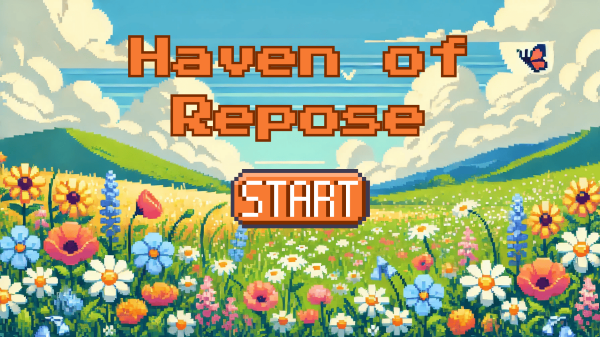
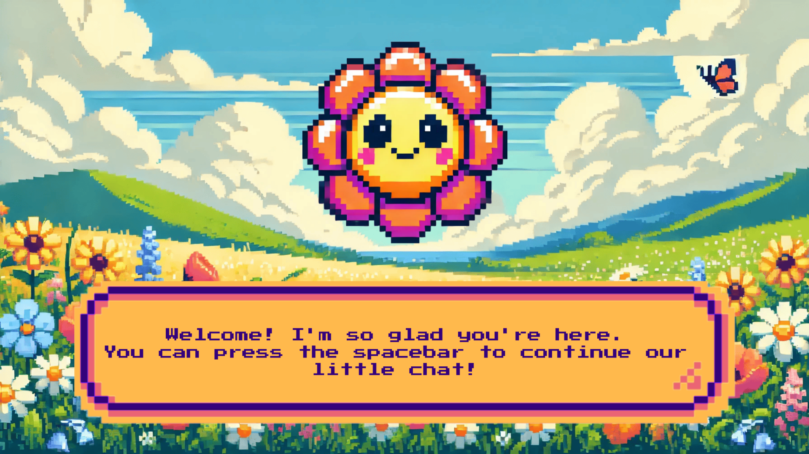

# Haven of Repose

## Screenshots

  
  

## Game Overview
**Haven of Repose** is a pixel-style speed-typing game that disguises itself as a soothing escape for stressed college students. Players are lulled into a sense of calm by a cute flower sprite, who guides them through relaxing nature scenes and a breathing exercise. Just when it feels like a haven, the flower reveals its true colors, mocking the player and plunging them into an unwinnable speed-typing challenge.

This game is designed for college students who've experienced burnout and the never-ending cycle of trying to "prove their worth." I wanted to highlight the ridiculous pressures students face in a unique and humorous way. The goal isn't to stress anyone out but to create a moment of reflection and laughter at how absurd these societal and academic expectations can be.

## Game Mechanics
The game starts simple: press the spacebar to interact with a cute flower sprite, move through calming nature scenes, and follow a breathing exercise. But then, the flower turns evil, mocking the player (student) for ever thinking they can relax. The players are forced into an endless speed typing game, which is unwinnable precisely because it's endless. And just when players think they can restart the game, the flower mocks them again for believing life gives second chances. The experience is meant to be an emotional rollercoaster that goes from serene to hilariously overwhelming.

## Sample Playthrough
You can watch the following playthrough to get a sense of the gameplay:

- **[Full Playthrough](https://drive.google.com/file/d/1xe6OYSNfEaUwYPLK0-fWL8WH2RctseLV/view?usp=sharing)**

## Play Online

You can enjoy **Haven of Repose** directly in your browser through this [p5.js link](https://editor.p5js.org/sm10688/sketches/bYDK5KyE0). No installation is needed! When playing, click on the canvas and press the "f" key to switch to fullscreen mode for the best experience.

## Technology Stack

- **p5.js**: The creative coding library powering the game.
- **HTML/CSS/JavaScript**: The core web development technologies used to implement the game logic and structure.

## Credits
I used the following resources and tools overall:
- Created the pixel art using [DALL-E 3](https://openai.com/index/dall-e-3/) and manually refined the art as needed using [Pixilart](https://www.pixilart.com/).
- Collected the following sound and video assets:
  - [River sound effect](https://youtu.be/NSMqGOXulXw?si=HSlHrbYGB-q0NBBN)
  - [Glitch video](https://youtu.be/CYcbnFL2HS4?si=Zc5QZ3MQzxZoBwla)
  - [Thunderstorm sound effect](https://www.youtube.com/watch?v=_xsa__9uQvk&t=8s)
  - [Wind sound effect](https://youtu.be/-bYltbDJDVQ?si=h6TTm2LcboW7Hmav)
All rights to the original assets belong to their respective creators.
